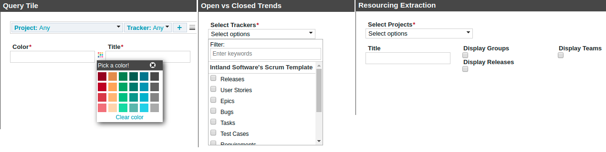
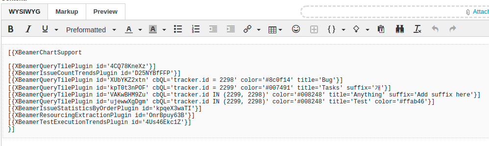
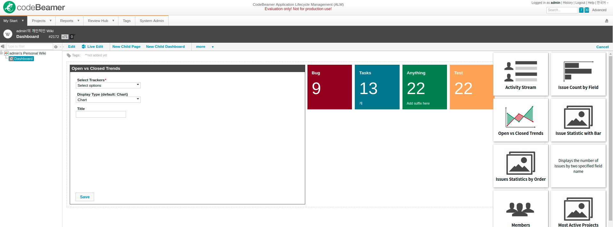
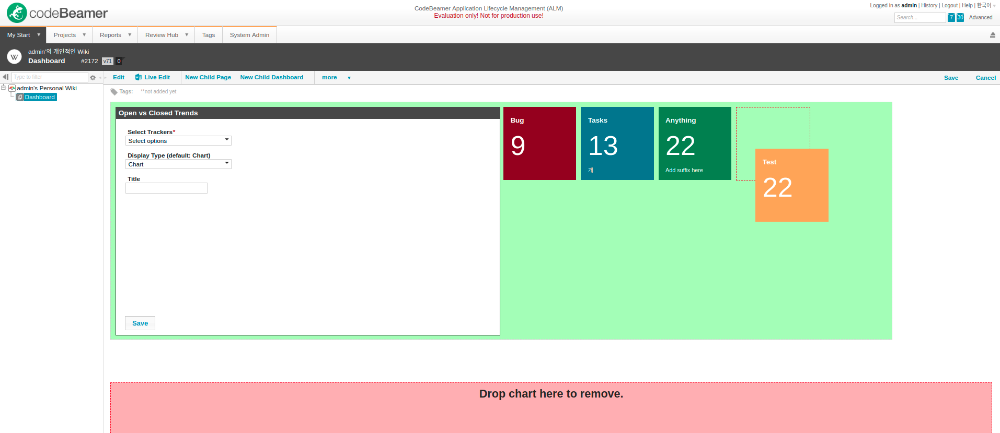

# Dashboard System for codeBeamer 7.1

**DO NOT USE, EDIT THIS PROJECT** this project would work at only old version and **NO COPYRIGHT GRANT, NO MAINTENANCE and NO WARRANTY.**

[codeBeamer](https://codebeamer.com/cb/) is a commercial ALM(Application Lifecycle Management) software.

And this project is general purpose dashboard implementation for an old version of codeBeamer.

## Features

### Wiki plugin that makes to use a wiki page as an dashboard

The XBeamerChartSupportPlugin and the XBeamerChartController.

They are kinda of meta-plugin to handle widgets and plugins.

### Widget system (`com.architectgroup.xbeamerchart.widget.base`)

Provides fully customizable, interactive configuration UI for plugin

Default widgets for general types (boolean, color, data, etc) and advanced types (codeBeamer internals and query) are included.

Widget helps people to configure each chart, even they don't know about codeBeamer's wiki markup.

It shows interactive form if user haven't configure yet, otherwise a specific plugin have info/matric/chart.

### Plugin system (`com.architectgroup.xbeamerchart.plugin.base`)

An interface that makes to create a new xbeamer-compatible plugin, also supports wrap exist plugin.

Manager enable interactive grid layout in the page. User can click `Relocation mode` to edit plugin grid with simple drag-n-drop.

20+ plugin examples under `com.intland.codebeamer.wiki.plugins`

## Technologies

- Java 7
- Basic HTML/CSS/JavaScript
- Apache Velocity (Template engine)
- [codeBeamer's Wiki API](https://codebeamer.com/cb/wiki/566240) and internals

It was designed and implemented when I was not programming in professional, so it's a bit old-fashioned technology and shit codes but well reflects my API design skills at the time.

## Questions (no one asked)

### Q. What's mean of "XBeamerChart"?

Ask my (ex-) boss.

### Q. Why?

Because old version of codeBeamer doesn't have any BI feature at that time. (codeBeamer has its own BI features since version 8.0)

### Q. You said you built it when you're not a programmer?

Yes. It was possible because most of the underlying technology was included already in the product, but I had programming knowledge about C++, Java and API design.

### Q. Did you design it yourself?

Yeah, most resources already included on codeBeamer but I designed the system.

The workflow refers to Jira's Gadget, but since the wiki plugin is the only extensible point that can be embedded into any page in the codeBeamer, I reinterpreted it as markup-based.

But candidate customers had difficulty with wiki markup, so it also had to be configurable as a simple interaction.

And, given the short duration for the various dashboard requirements, the abstraction needed to increase productivity.

### Q. Why open source?

This project has been dropped and has not been made public. (except a demo to codeBeamer onetime)

I'm the only author of this project and probably the only person who remember it. I have decided to release the source code for personal reasons because the company has not made any copyright statements.

This source code is very early in my career and doesn't currently reflect my skills. I'm way better now :P
